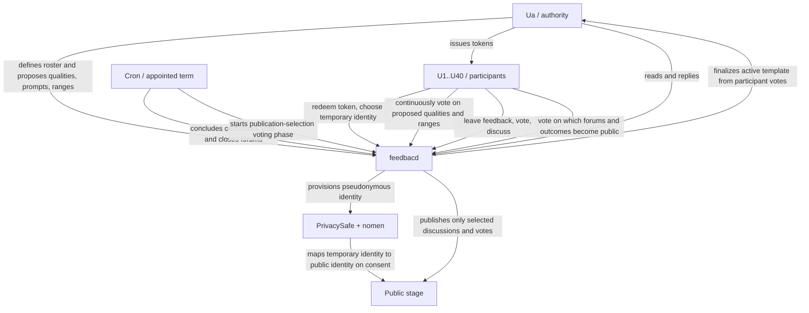
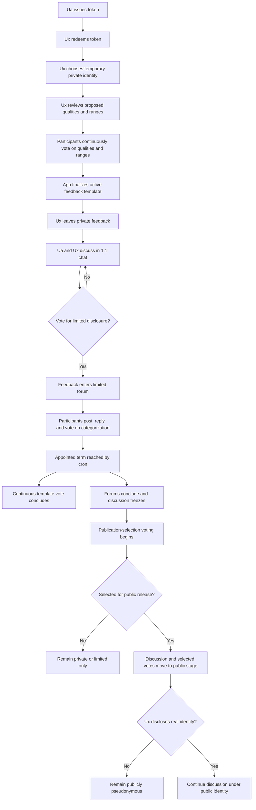
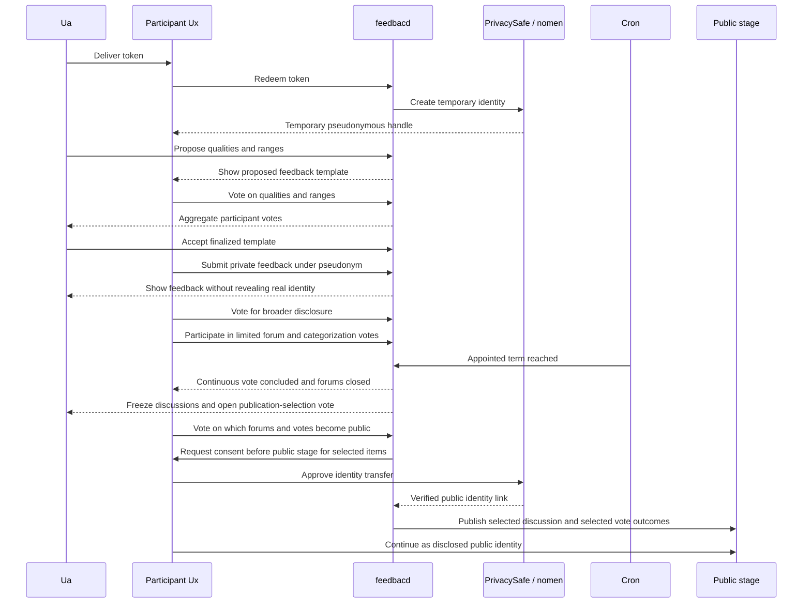
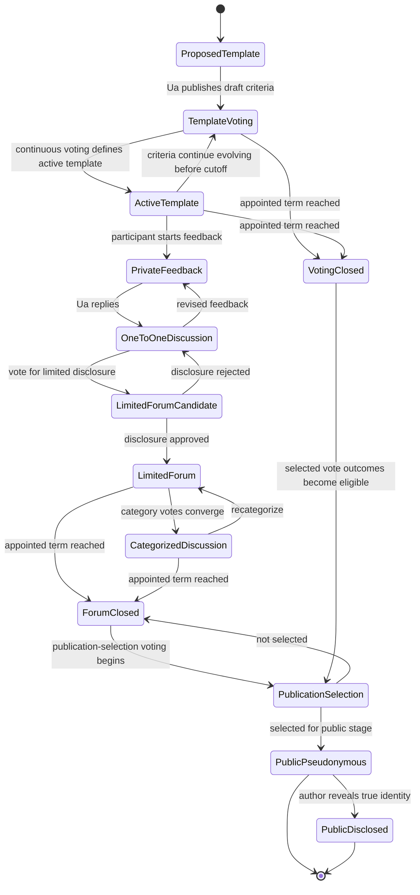

# 0xfeedbacd

A privacy and governance mechanism for feedback under asymmetry of power.

## Intent

A feedback app that:
- Enables User A (Ua) to:
  - define a set of users: (eg. 40 users U1...U40)
  - give them tokens of identification
  - establish/accept some qualities and quantities/ranges that Ua needs feedback on by continous vote (could be pre-set for certain domains (like in Academia))
  - read and answer to the (additional) freeform feedback:
    - first: as 1-on-1 chats
    - second: as a limited forum: U1..40+a
    - third: in a public stage if all participants are in agreement to make this public
- Enables Users 1 - 40 (U1..40) to:
  - choose a temporary identity using the token
  - choose another identity using the same token
  - this identity is private (not known to any other user)
  - using this identity, the user Ux can:
    - vote on the qualities and ranges proposed
    - leave private feedback
    - vote for limited disclosure for his feedback
    - participate in the limited forum: continue discussion of his feedback, post, reply to other feedbacks
    - vote for discussion categorizations
    - vote for disclosure for a discussion he was a party to
    - disclose his true identity and continue the discussion in public
- At an appointed term (by cron):
  - the continous vote is concluded
  - the forums are concluded and 
  - voting commences to make a selection of forums/votes public (or not)

## Resources

Look at /Users/christiantzurcanu/Documents/dev/nomen/ that is live at https://nomen.provable.dev

This is what will be used to transfer identity from initial private identities to public identities
Probably the first identity will be with PrivacySafe and will look like an email (<id_u1>@PrivacySafe.xyz)

PrivacySafe has apps for:
- sending email with protected identity
- chatting with protected identity
- notarization on Kayros

Mythos has contracts for:
- continous voting
- notarization on Kayros

Nomen implements identity transfer:
- from PrivacySafe
- to any Social Media: X.com
- from one course to the next

## Honor and Prestige

The Professor or Manager who will have the social contract with the students that he will not vote (or he will have his vote weighted equally to his students') will have a chance to acquire professional prestige.
The 1-on-1 chats may happen only during office hours to make sure that the time/effort is not abused.
The honor of the entire power role/institution may be elevated by using privacy.

## Domains of Application

Usecases fit best the situation where Ua has power over U1-40:
- Academia: Ua is a Professor and U1-40 are students.
- Housing or dorm governance: tenants/residents giving structured feedback to a landlord, RA, or housing office.
- Industry: Ua is a supervisor/manager, and U1-40 are employees under him.
- Research labs: PI or lab head over PhD students, postdocs, and research assistants.
- Justice trials with jurors: Ua is the judge, U1-40 are the jurors (requires unanimity at the final tally).
- Sports teams: coach over players, especially academy, college, or youth systems.
- Nonprofits and volunteer corps: coordinator over volunteers where retaliation risk is real.
- Religious institutions: clergy or seminary leadership over seminarians or community workers.
- Political party meetings: leaders over the other party members.

## Guarantees

### Ua is guaranteed:

- control over cohort formation: Ua defines the participant set and issues the tokens.
- a structured feedback process, not just raw messages: participants continuously vote on the feedback criteria, and the app finalizes an active template from those votes.
- a right of reply: feedback can be answered in 1:1 chat, then potentially in a limited forum, and only later in a public stage.
- closure: at the appointed term, voting and forums end, so the process cannot stay indefinitely fluid.
- unilateral control over disclosure. Public release depends on participant voting and, for identity revelation, participant consent.

### Ux is guaranteed:

- temporary private identity inside the system.
- participation in shaping the evaluation criteria, not just answering them.
- a graduated disclosure ladder: private feedback first, then optional limited disclosure, then optional public stage.
- that private information remains private until all parties agree to disclosure; this is the clearest normative guarantee.
- that even if material becomes public, identity disclosure remains optional; the public stage can remain pseudonymous unless Ux approves identity transfer.

Ux is not guaranteed freedom from social pressure outside the system. Privacy reduces retaliation risk, but it does not define enforcement against out-of-band coercion.

### Society at large is guaranteed:

- that only selected discussions and vote outcomes become public, not the entire private corpus.
- a mechanism intended to improve feedback quality in power-imbalanced settings by shielding participants early and encouraging recognition later.
- better legitimacy of authority: “honor,” “prestige,” and elevation of the Ua's institution when privacy is used well.
- cryptographic verifiability of the information that will be disclosed.

## Virtue

(According to https://virtues.provable.dev/.)

Measurability by feedback is essential to Academia and Industry. It is the first step to achieve Industriousness and Abundance. However, it may be impeded by incorrect/byased application of Governance and Justice/Fairness.
In order to isolate one virtue from the diminishing effects of other virtues, this system uses temporary privacy. Since privacy is not a virtue when it is eternal, this system guarantees that the private info remains private until all parties agree to disclosure, but encourages disclosure as the final conclusion for increasing Recognition https://virtues.provable.dev/docs/harmony.

## Diagrams

### System context

### Feedback and disclosure lifecycle

### Identity transition sequence

### Disclosure state machine

